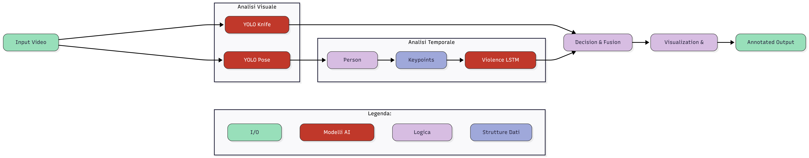

# Real-time Detection System for Suspicious Stabbing Movements

An advanced real-time surveillance system designed to detect violence and potentially dangerous stabbing movements using Computer Vision and Deep Learning.


## Overview

This project implements a multi-stage pipeline to identify violent intent in real-time video streams. By combining object detection, pose estimation, and temporal sequence analysis (LSTM), the system can distinguish between normal activities and suspicious stabbing motions.

### Key Features
* **Real-time Analysis**: Processes video feeds with low latency.
* **Object & Pose Detection**: Simultaneously detects persons, weapons (knives), and body keypoints.
* **Temporal Logic**: Uses Long Short-Term Memory (LSTM) networks to understand the context of movement over time.
* **Optimized Performance**: Implements frame skipping logic (processing 1 frame every N) while maintaining the required input buffer for the LSTM model.

---

## Demo

Test videos of the system detecting suspicious stabbing movements can be seen here:

https://www.youtube.com/playlist?list=PLo1f0U_Wr1t2QE8hyGbKqB8WCAeb5DOUH

The playlist includes multiple real-world test scenarios showing both violent and non-violent actions processed by the detection pipeline.

---

## System Architecture

The workflow consists of four main stages:

1.  **Object Detection (YOLO11)**
    * Identifies instances of `person` and `knife`.
    * *Fine-tuned model:* Specifically trained to recognize knives with high precision using a custom dataset.
    * Associates detected weapons with the closest person/hand.

2.  **Pose Estimation (YoloPose)**
    * Extracts skeletal keypoints (wrists, elbows, shoulders).
    * Tracks motion vectors to analyze arm dynamics.

3.  **Human Activity Recognition (HAR)**
    * **Model**: LSTM (Long Short-Term Memory).
    * **Logic**: Classifies motion patterns based on a sequence of 150 frames to detect stabbing actions.

4.  **Alert System**
    * Triggers a real-time alert when the confidence threshold for violent action is exceeded.
    * Saving the face cropepd from the frame of the person who confidence threshold for violent action is exceeded

---



---

## Tech Stack

* **Core**: Python, OpenCV
* **Computer Vision**: [Ultralytics YOLO](https://github.com/ultralytics/ultralytics) (Object Detection & Pose)
* **Deep Learning**: TensorFlow / Keras (LSTM)
* **Data Management**: [Roboflow](https://roboflow.com/) (Dataset preprocessing)
* **Datasets**:
    * Custom Knife Dataset
    * [Automatic Violence Detection Dataset (GitHub)](https://github.com/airtlab/A-Dataset-for-Automatic-Violence-Detection-in-Videos/tree/master)
    * [Indoor action DAtaset (GithHub)](https://github.com/DaniDeniz/IndoorActionDataset)
    * [Real Life Violence Situations Dataset (Kaggle)](https://www.kaggle.com/datasets/mohamedmustafa/real-life-violence-situations-dataset)
    * [RWF2000 (Kaggle)](https://www.kaggle.com/datasets/vulamnguyen/rwf2000)

---

## Getting Started

### Prerequisites
* Python 3.8+
* CUDA-enabled GPU (recommended for real-time inference)

### Installation

1.  **Clone the repository**
    ```bash
    git clone [https://github.com/lraton/real-time-violent-action-detection.git](https://github.com/lraton/real-time-violent-action-detection.git)
    cd real-time-violent-action-detection/src/
    ```

2.  **Install dependencies**
    ```bash
    pip install -r requirements.txt
    ```

### Running the Application

#### Option A: Windows (CPU / Standard Shell)
Use this for testing without specific GPU configuration.

```bash
python main.py
```

#### Option B: WSL / Linux (GPU Accelerated)

Recommended for best performance using TensorFlow with GPU support.

```
# Activate your environment (if applicable)
source ~/my_venv/bin/activate

# Run the main script
python main.py
```