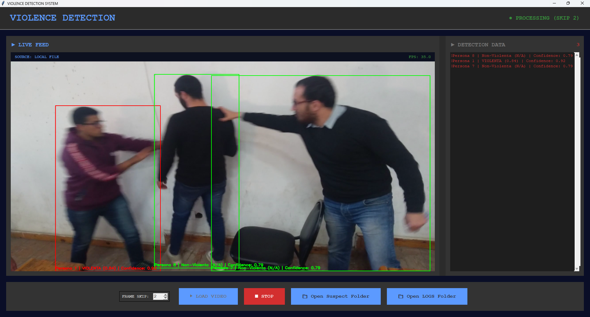

# Real-time Detection System for Suspicious Stabbing Movements

This project implements a real-time detection system to identify potentially dangerous stabbing movements using advanced computer vision and machine learning techniques.

---



---

##  Technologies and Tools

- **YOLO (You Only Look Once)**: Object detection with Ultralytics.
  - YoloPose: Pose keypoint
  - Yolo: object detection
    - Fine tuned for knife
    
- **Roboflow**: Data management and preprocessing.
  - knife dataset
        
- **Violence Detection Dataset**: Dataset specifically designed for identifying violent actions.
    
    - [Violence Detection Dataset GitHub](https://github.com/airtlab/A-Dataset-for-Automatic-Violence-Detection-in-Videos/tree/master)
        

---

## Start program

### Windows

#### Shell senza GPU per lstm

```
pip install -r requirements.txt

python main.py
```


#### WSL per gpu con TensorFlow (lstm)

```
wsl -d Ubutnu

source ~/my_venv/bin/activate

pip install -r requirements.txt

python main.py
```

---

# TODO
- [x] Modificare classe yoloapp
  - [x] Dividere in piu classi, predict e gui
-  [X] Elaborare solo 1 frame su N
   -  [X] In base a N, per ogni frame processato aggiungere N fram vuoti (o uguali) per lstm, che ne vuole comunque 150
- [ ] Addestrare nuovo modello con non-violent Cam3
- [ ] Ottimizzare
  - [X] Drawing      : 1.0 ms , Se rimuovo plot delle pose
  - [ ] Knife Detect : 28.0 ms
  - [ ] Pose Detect  : 73.5 ms
    - [ ] Usare tensort come modello
    - [ ] Provare MoveNet Lightning
  - [ ] Logic/LSTM   : 78.0 ms
    - [ ] tf.lite.TFLiteConverter
    - [ ] Quantizzazione 8bit
---

## 📝 Workflow Steps

1. **Object Detection (YOLO)**:
    
    - Analyze each video frame to detect instances of:
        
        - `person`
            
        - `knife`
            
    - Associate detected knives with the closest identified hand/person.
        
2. **Pose Estimation (YOLO)**:
    
    - Extract keypoints such as wrists, elbows, and shoulders.
        
    - Calculate and track **motion vectors** of arms and hands.
        
3. **Human Activity Recognition HAR**:
    
    - Use machine learning methods (e.g., LSTM or CNN) to classify motion patterns over time.
        
    - Identify suspicious patterns indicative of stabbing or violent intent.
        
4. **Alert Triggering**:
    
    - Generate a real-time alert if the system detects:
