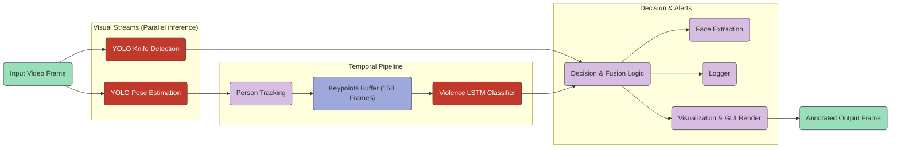

# System Architecture & Pipeline

The system uses a **hybrid multi-stage pipeline** that combines object detection, human pose estimation, tracking, and temporal sequence modeling (LSTM) to detect suspicious violent actions in real-time. 

Here is a high-level flowchart of the data flow and system pipeline:

---

## 1. Visual Streams (Object & Pose Detection)

Every incoming video frame is processed in parallel by two distinct Computer Vision models using PyTorch (GPU/CUDA accelerated when available):

### YOLOv11 Weapon Detection
* **Purpose**: Specifically detects knives and potential stabbing weapons in the frame.
* **Implementation**: Fine-tuned YOLOv11 model (`best.pt`) with a custom dataset.
* **Optimization**: Executed with a confidence threshold of `0.6` and input image size of `256` (`imgsz=256`, `half=True`) for low-latency processing.
* **Output**: A list of bounding boxes, labels (`knife`), and confidences.

### YOLOv11-Pose Estimation
* **Purpose**: Tracks individuals in the frame and extracts their skeletal structure.
* **Implementation**: YOLOv11-Pose model (`yolo11n-pose.pt`) loaded onto the GPU/CPU device.
* **Tracking**: Utilizes the `botsort.yaml` tracker configuration (`persist=True`) to assign a unique, persistent ID to every person detected across frames.
* **Output**: Bounding boxes, person tracking IDs, and keypoint arrays (17 joints per person, with `(x, y)` coordinates and detection confidence).

---

## 2. Temporal Pipeline (Tracking & Keypoint Buffer)

Since stabbing is a temporal action (defined by speed, direction, and repetitive arm swing vectors), a single static frame is insufficient to classify violence.

1. **Torso-Relative Keypoint Normalization**:
   To ensure the system works regardless of where the person is standing relative to the camera (scale and position invariance), all 17 keypoint coordinates are centered on the person's torso:
   `Normalized Point = (Point - Torso Center) / Shoulder Width`
   If shoulders are not detected, a center point of `(0.5, 0.5)` is used as a fallback.

2. **Temporal Keypoint Buffer**:
   For each tracked person ID, the system maintains a keypoint sequence inside a double-ended queue (`deque` with `maxlen=150`).
   - The queue accumulates keypoint frames. Each frame consists of 17 joints with $(x, y, confidence)$ coordinates, flattened into a vector of **51 features**.
   - Input shapes are padded or truncated to **150 frames** to match the LSTM model input requirements.

---

## 3. Violence LSTM Classifier

Once a person's temporal keypoint buffer accumulates enough frames (at least 30 frames, adjusted for the active `frame_skip` value), the sequence is sent to the Keras-loaded **Bidirectional LSTM** model.

* **Padding**: The buffer (if shorter than 150 frames) is padded with a mask value of `-999.0` at the end (post-padding).
* **Masking Layer**: A masking layer in the LSTM network ignores all time steps with the value `-999.0`.
* **Inference**: The network analyzes keypoint trajectories and outputs a float value between `0.0` and `1.0`, indicating the probability of the sequence containing a stabbing motion.

---

## 4. Decision & Fusion Logic

The system fuses the outputs of the Knife Detection and the LSTM Classifier to determine the threat level.

### Safe / Non-Violent (Green)
* **Conditions**: No knife detected, and the LSTM violence score is below the threshold (`VIOLENCE_THRESHOLD = 0.7`).
* **Visuals**: A green bounding box and `Persona [ID] | Non-Violenta` label are rendered around the subject.

### Weapon Suspect (Red / Danger)
* **Conditions**: A knife bounding box overlaps with a person's bounding box.
* **Fusion**: If there is spatial overlap (Intersection over Union) between a detected weapon and a tracked person, the person is immediately elevated to **Sospetto CON COLTELLO** (Knife Suspect) regardless of the LSTM score, and the box is colored red.

### Violent Action (Red / Danger)
* **Conditions**: The LSTM violence score exceeds `0.7`.
* **Visuals**: A red bounding box and `VIOLENTA` label are rendered, showing the classification confidence (e.g. `(0.85)`).

---

## 5. Alerts & Log Management

When a threat is confirmed (either *Knife Suspect* or *Violent Action*):

1. **Face Extraction**:
   - The system retrieves the coordinates of the first 5 keypoints (nose, eyes, ears) representing the person's face.
   - If keypoints are valid, it expands the area slightly to capture the head; otherwise, it falls back to the top third of the person's bounding box.
   - The cropped face is saved as a `.jpg` image under `suspect/face_susp_[person_id]_[timestamp].jpg`.
   - A tracking set prevents saving duplicate photos for the same person ID during a single run.

2. **Log Writing**:
   - Generates a text file named `logs/log_[YYYYMMDD].txt`.
   - Appends detailed records: `[YYYY/MM/DD-HH:MM:SS] [Label] [ID] | [Status] (Score) | Confidence: [Val]`.
